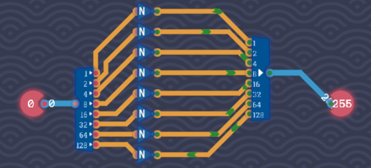

# 图灵完备思路整理
### 一、基础逻辑运算
#### 非门

#### 或门

#### 或非门

#### 高电平

#### 三路与门

#### 三路或门

#### 异或门

#### 同或门

### 二、算术运算
#### 半加器

#### 全加器

### 三、处理器架构
### 四、编程
### 五、处理器架构2
### 六、函数
### 七、汇编挑战
### 未分类
#### 一位取反器

#### 一位开关

#### 一位解码器

#### 三位解码器

#### 优雅存储

#### 信号记数

#### 元件工坊

#### 八位全加器

#### 八位或

#### 八位非

#### 加倍

#### 奇变偶不变

#### 奇数个信号

#### 存储一字节

#### 小盒子

#### 延迟线

#### 总线

#### 成对的麻烦

#### 指令解码器

#### 数据选择器

#### 条件判断

#### 相反数

#### 第二刻

#### 算数引擎

#### 计数器

#### 逻辑引擎

